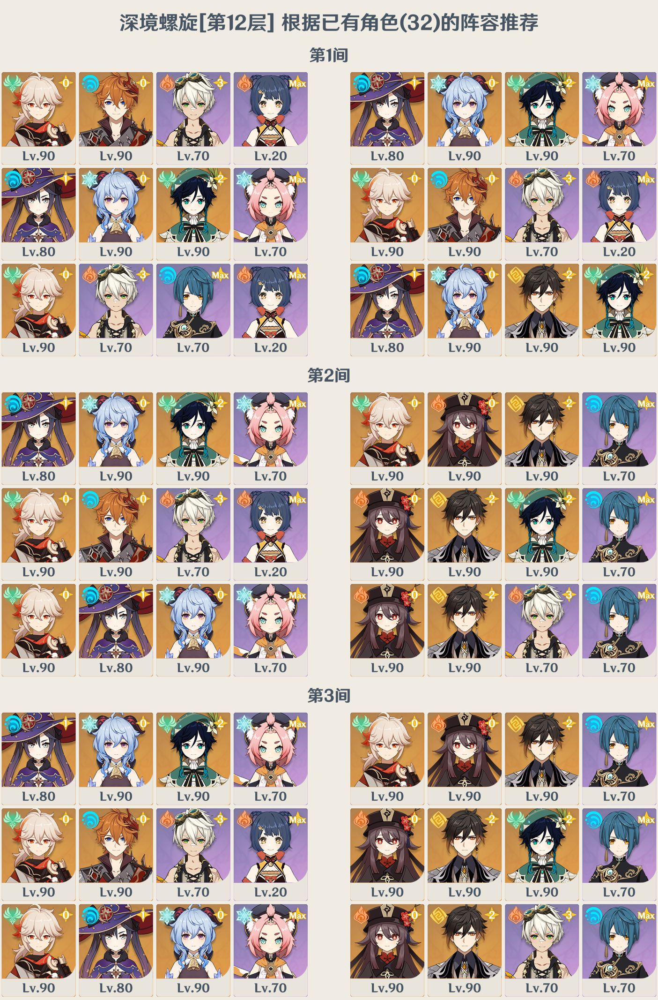
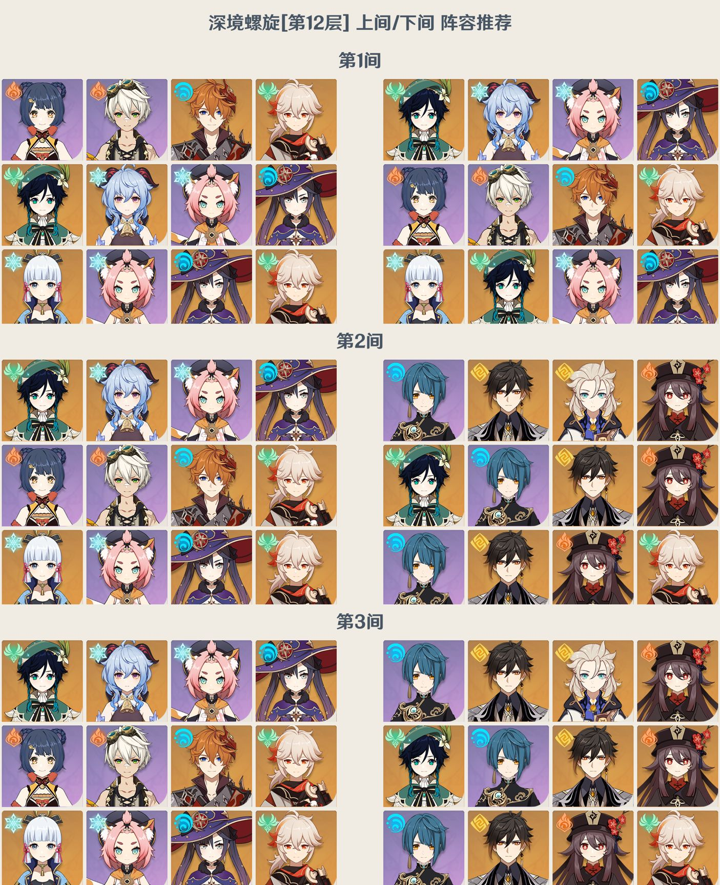
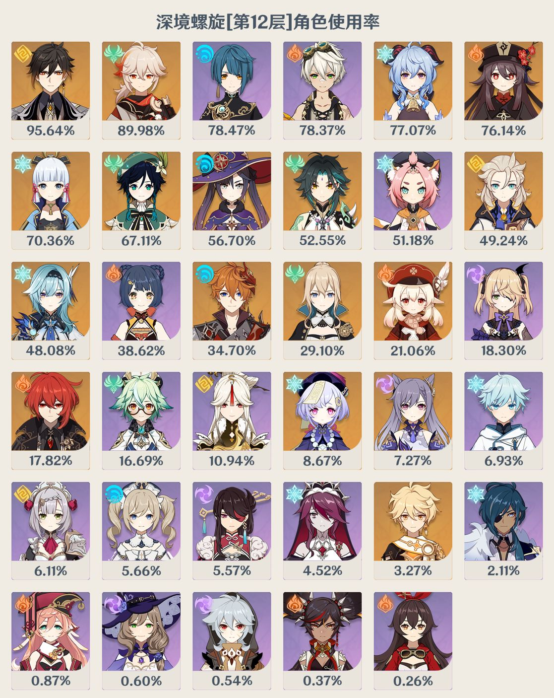
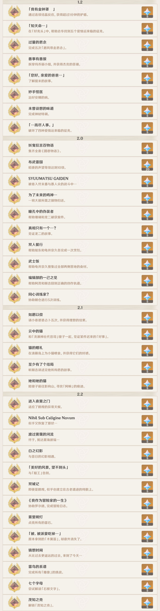

# 原神插件

---
之后杂项都更新到这个插件里 </br>

安装依赖
> pip install pyyaml -i https://pypi.tuna.tsinghua.edu.cn/simple
>
> pip install sqlitedict -i https://pypi.tuna.tsinghua.edu.cn/simple
>
> pip install prettytable -i https://pypi.tuna.tsinghua.edu.cn/simple

---

## 原神公告指令

命令  | 说明 | 例
------------- | ------------- | -------------
原神公告  | 相当于游戏内公告 |
原神公告#  | 查看某个公告详细信息 | 原神公告#1992
订阅原神公告 | 如果有新公告将推送到群内 |
取消订阅原神公告 | |
取消红点# | 取消游戏内的红点公告,只需要uid | 取消红点#105293904

## 设置材料收集提醒

命令  | 说明 | 例
------------- | ------------- | -------------
收集材料#材料名字  | 根据配置文件中材料的时间通知设定者 | 收集材料#水晶矿
收集材料#自定义10 | 自定义一个时间提醒 | 收集材料#探索16
收集材料# | 查看自己设定的材料列表 |

## 原神猜语音小游戏

命令  | 说明 | 例
------------- | ------------- | -------------
原神猜语音  | 开始原神猜语音 | 不指定语音则为中文
原神猜语音日 | 选择日语语音包 | 可选语音包 日 英 韩
原神猜语音排行榜 | 查看本群排行榜 | 原神猜语音排行榜
原神语音| 发送指定人物的随机语音 | 原神语音刻晴
更新原神语音资源 | 第一次安装时一定要选运行这个指令 |

<details>
<summary>示例</summary>


</details>

## 原神抽卡

命令  | 说明 | 例
------------- | ------------- | -------------
原神十连  | 一次10连抽卡 |
原神一单  | 一次50连抽卡 |
原神切换卡池 | 可以切换为 限定\武器\常驻 | 原神切换卡池武器

<details>
<summary>示例</summary>

部分素材来自于 [Adachi-BOT](https://github.com/SilveryStar/Adachi-BOT)


</details>

## 查询玩家信息

插件调用的是米游社角色信息的接口,查询的信息也是基于上面的基础信息<br>
需要到米游社获取cookie配置到`config.yml`文件里 `setting`下的`cookies`里

命令  | 说明 | 例
------------- | ------------- | -------------
ys#UID  | 查询一个UID信息 | ys#105293904
ys#@xxx | 查询群友的UID,必须能@到人 | ys#@xxx
ys#  | 查询用户上一次查询的UID信息 | ys#
ysa#  | 和ys#一样 但是显示全部角色 | ysa#

<details>
<summary>示例</summary>

界面作者 [明见佬](https://github.com/A-kirami)


</details>

## 深渊速查

[数据来源](https://spiral-abyss.appsample.com)

命令后可以添加层数 不写默认12层<br>

例: <br>
原神深渊配队 查询12层  <br>
原神深渊配队11 则查询11层

命令  | 说明 | 例
------------- | ------------- | -------------
原神深渊配队 | 根据已有的角色推荐队伍 | 原神深渊配队11
原神深渊速查  | 查询一层深渊阵容推荐列表 | 原神深渊速查11
原神深渊使用率 | 查询一层深渊角色使用率 | 原神深渊使用率11

<details>
<summary>示例</summary>







</details>


## 原神成就

<details>
<summary>使用须知</summary>

需要申请[百度OCR](https://cloud.baidu.com/product/ocr)
拿到`API_KEY`和`SECRET_KEY` 配置到`config.yml`文件里的
```yaml
  baidu_ocr:
    API_KEY: ********
    SECRET_KEY: ********
```

</details>

原神成就查漏功能 (用ys#绑定 切换号直接查询另一个就好)<br>
不获取游戏内任何数据,仅仅只是记录玩家完成的成就<br>
方便查看还有什么隐藏成就尚未完成<br>
只有未完成的成就数量小于100时才有界面<br>

使用方法:<br>

(方法1): 可以直接使用命令后跟n张游戏内的截图来进行更新,例如<br>
原神成就[完成的成就截图1][完成的成就截图2][完成的成就截图3]

(方法2): 可以上传图床然后使用命令跟n个上传的图片地址更新,例如<br>
原神成就<br>
https://imgtu.com/i/h5Rq6x<br>
https://imgtu.com/i/h5RHpR<br>
https://imgtu.com/i/h5Rb11<br>

支持的图床有<br>
https://imgtu.com/<br>
https://ibb.co/<br>


命令  | 说明 | 例
------------- | ------------- | -------------
原神成就? | 查看功能帮助 | 原神成就?
原神成就 | 查看未完成的成就列表 | 原神成就
原神成就[游戏截图1][游戏截图2]  | 添加已完成的成就 | -


<details>
<summary>返回示例</summary>



</details>